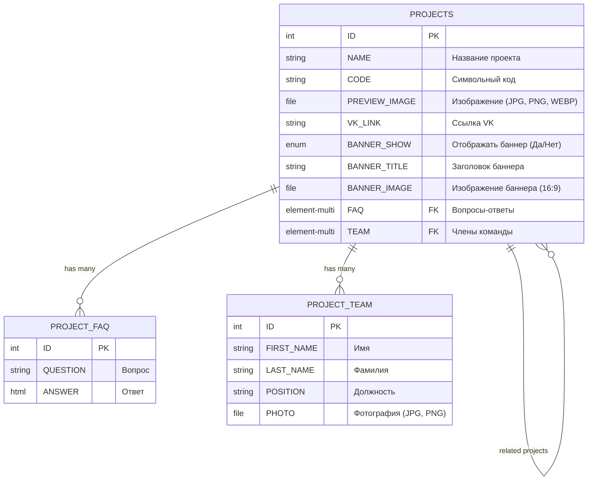

# Паттерны полей из ТЗ и примеры

## Содержание
1. [Паттерны преобразования ТЗ в поля](#паттерны-преобразования-тз-в-поля)
2. [Примеры переиспользования инфоблоков](#примеры-переиспользования-инфоблоков)
3. [Универсальные переиспользуемые инфоблоки](#универсальные-переиспользуемые-инфоблоки)
4. [Пример Mermaid ER-диаграммы](#пример-mermaid-er-диаграммы)
5. [Пример текстового описания](#пример-текстового-описания)
6. [Пример конфига инфоблока](#пример-конфига-инфоблока)
7. [Распространённые ошибки](#распространённые-ошибки)

---

## Паттерны преобразования ТЗ в поля

### Секции с управлением видимостью
```
ТЗ: "Блок можно скрыть в админке"
-> Поле: SECTION_NAME_SHOW, type: 'L', values: ['Да', 'Нет']
```

### Секции с заголовком
```
ТЗ: "Заголовок редактируется в админке"
-> Поле: SECTION_NAME_TITLE (type по умолчанию 'S')
```

### Карточки с фиксированным количеством
```
ТЗ: "Три карточки, каждая с заголовком и описанием (редактируются в админке)"
-> Поля в основном инфоблоке:
   - CARD_1_TITLE
   - CARD_1_TEXT, user_type: 'HTML'
   - CARD_2_TITLE
   - CARD_2_TEXT, user_type: 'HTML'
   - CARD_3_TITLE
   - CARD_3_TEXT, user_type: 'HTML'
```

### Карточки с неограниченным количеством
```
ТЗ: "Карточки, количество не ограничено, управляются в админке"
-> Создать отдельный инфоблок
-> Привязка: CARDS_X, type: 'E', multiple: true, link_iblock_id: 'cards_x'
```

### Галереи медиа
```
ТЗ: "До 4 медиа-элементов (фото/видео), порядок задается в админке"
-> Вариант 1 (немного элементов): Поля в основном инфоблоке
   - IMAGES, type: 'F', multiple: true
   - VIDEO_URLS, multiple: true
-> Вариант 2 (для переиспользования): Отдельный инфоблок
   - Привязка: GALLERY, type: 'E', link_iblock_id: 'project_gallery'
```

### Ссылки на соцсети
```
ТЗ: "Иконки соцсетей (VK, ОК), ссылки редактируются в админке"
-> Поля: VK_LINK, OK_LINK
(Логика скрытия реализуется в шаблоне)
```

### Кнопки с действиями
```
ТЗ: "Кнопка 'Перейти', текст и URL редактируются в админке"
-> Поля: BUTTON_TEXT, BUTTON_URL
```

### Аккордеоны/FAQ
```
ТЗ: "Список вопросов-ответов, управляются в админке"
-> Отдельный инфоблок с полями QUESTION и ANSWER (user_type: 'HTML')
-> Привязка: FAQ, type: 'E', multiple: true, link_iblock_id: 'faq'
```

### Текстовые поля с типографикой
```
ТЗ: "Заголовок редактируется в админке" (видимый пользователям текст)
-> Поле с typograph: true для автоматической расстановки неразрывных пробелов
```

---

## Примеры переиспользования инфоблоков

### Полное совпадение
```
ТЗ: "Вопросы-ответы, управляются в админке"
Существует: project_faq (QUESTION, ANSWER)
-> Использовать project_faq
```

### Частичное совпадение
```
ТЗ: "Карточки команды: имя, фамилия, должность, фото, email"
Существует: project_team (FIRST_NAME, LAST_NAME, POSITION, PHOTO)
-> Добавить поле EMAIL к project_team
```

### Несовместимость
```
ТЗ: "Карточки достижений: название, описание, дата, категория"
Существует: project_team (FIRST_NAME, LAST_NAME, POSITION, PHOTO)
-> Создать новый инфоблок project_achievements
```

### Семантическая несовместимость
```
ТЗ: "Список преимуществ: заголовок, описание"
Существует: project_faq (QUESTION, ANSWER)
-> Создать новый: преимущества != FAQ, хотя структура похожа
```

---

## Универсальные переиспользуемые инфоблоки

- **FAQ** -- вопросы-ответы (QUESTION, ANSWER)
- **Team** -- члены команды (FIRST_NAME, LAST_NAME, POSITION, PHOTO)
- **Gallery** -- медиа-контент (IMAGES, VIDEO_URLS)
- **Reviews** -- отзывы (NAME, TEXT, PHOTO, RATING)
- **Partners** -- логотипы партнёров (NAME, LOGO, URL)

---

## Пример Mermaid ER-диаграммы



---

## Пример текстового описания

```
## Анализ существующих инфоблоков

Найдены:
- project_faq (QUESTION, ANSWER)
- project_team (FIRST_NAME, LAST_NAME, POSITION, PHOTO)

## Решения

1. FAQ: Переиспользуется project_faq
2. Команда: Дополняется project_team (+ EMAIL)
3. Достижения: Создаётся achievements (семантически отличается)

## Описание инфоблоков

### projects
[список полей]

### project_faq (СУЩЕСТВУЮЩИЙ)
Без изменений

### project_team (СУЩЕСТВУЮЩИЙ + EMAIL)
Добавляется: EMAIL

### achievements (НОВЫЙ)
Поля: [...]
```

---

## Пример конфига инфоблока

Минимальный конфиг (с global.php где задан default_iblock_type):

```php
<?php
return [
    'iblock' => [
        'code' => 'project_team',
        'name' => 'Команда проекта',
    ],
    'include_standard_fields' => ['NAME', 'SORT'],

    'properties' => [
        'POSITION' => ['name' => 'Должность', 'typograph' => true],
        'PHOTO'    => ['name' => 'Фото', 'type' => 'F', 'file_type' => 'jpg,png,webp'],
        'EMAIL'    => ['name' => 'Email'],
    ],

    'demo_data' => [
        [
            'code' => 'ivan-ivanov',
            'name' => 'Иван Иванов',
            'sort' => 100,
            'properties' => [
                'POSITION' => 'Директор',
                'PHOTO'    => '/local/config/assets/team/photo.jpg',
                'EMAIL'    => 'ivan@example.com',
            ],
        ],
    ],
];
```

Ключевые умолчания:
- `type` свойства по умолчанию `'S'` (можно не указывать для строк)
- `version` по умолчанию `'1.0'`
- `sync_mode` по умолчанию `'soft'`
- `fields` генерируется автоматически из `properties`
- `property_type` для ElementDataExtractor выводится из типа свойства
- enum-значения можно задавать плоским списком: `'values' => ['Да', 'Нет']`
- `typograph: true` -- неразрывные пробелы после предлогов при чтении

---

## Распространённые ошибки

### Создание полей для статического контента

**Неправильно:**
```
ТЗ: "Навигационные стрелки справа внизу"
-> Создать поле SHOW_ARROWS, type: 'L'
```

**Правильно:**
```
-> Статический элемент шаблона, поля не требуются.
```

### Создание инфоблока для фиксированных нередактируемых карточек

**Неправильно:**
```
ТЗ: "Три карточки с заголовком и описанием"
-> Создать связанный инфоблок
```

**Правильно:**
```
-> Нет указания на редактируемость -- статический контент.
```

### Указание type: 'S' для строковых свойств

**Избыточно:**
```php
'TITLE' => ['name' => 'Заголовок', 'type' => 'S'],
```

**Достаточно:**
```php
'TITLE' => ['name' => 'Заголовок'],
```

### Ручное задание fields

**Избыточно:**
```php
'fields' => [
    'NAME'  => ['type' => 'standard'],
    'TITLE' => ['type' => 'property', 'property_type' => 'string'],
    'TAG'   => ['type' => 'property', 'property_type' => 'enum'],
],
```

**Достаточно:**
```php
'include_standard_fields' => ['NAME'],
// fields сгенерируется автоматически из properties
```

### Игнорирование существующих инфоблоков

Всегда проверяй `local/config/iblocks/` перед созданием нового.
